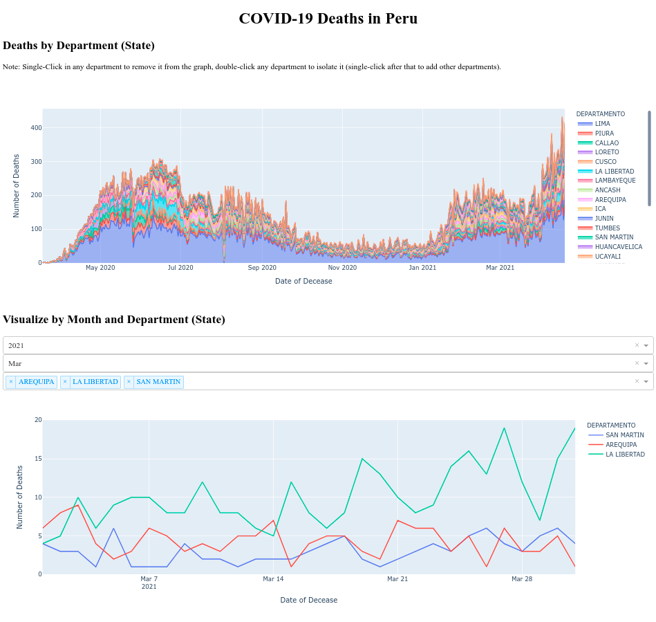

# COVID-19 Deaths in Peru 
This script creates a basic web dashboard, with Dash and Ploty, that contains 
an interactive area graph to see the evolution of deaths by department (state)
in Peru since the start of the pandemic until April, 2021; and an interactive
line graph of deaths by state and month.



## The Dataset

The dataset used was extraced from http://datosabiertos.go.pe website.
(https://www.datosabiertos.gob.pe/dataset/fallecidos-por-covid-19-ministerio-de-salud-minsa)

- Publisher:              Datos Abiertos de COVID-19
- Last Update:            23-04-2021
- Frequency:              Daily
- License:                Open Data commons Attribution License
- Lenguage:               Spanish (Peru)
- Author:                 Ministerio de Salud (MINSA) -  Ministry of Health
- Public Access Level:    Public

## Contents

```bash
.
├── data
│   └── fallecidos_covid.csv
├── index.py
├── README.md
├── requirements.txt
└── screenshot.png
```

## Frequency

This repository will be updated every week.

Last update: 23-04-2021

Soon to be deployed to Heroku!